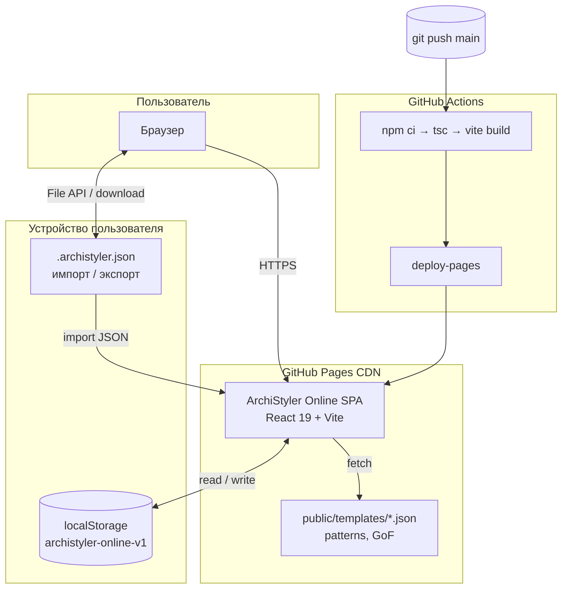
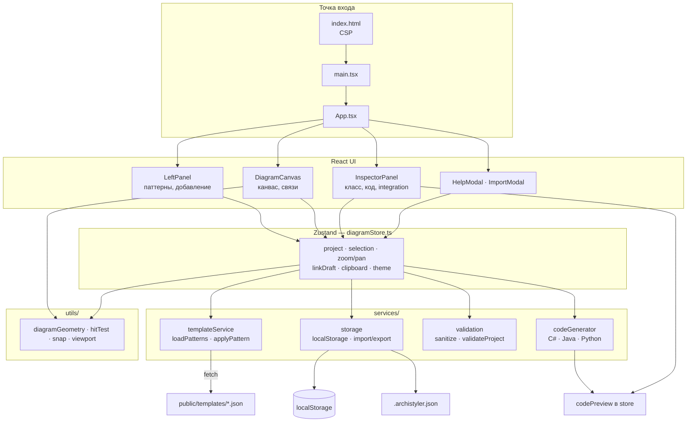
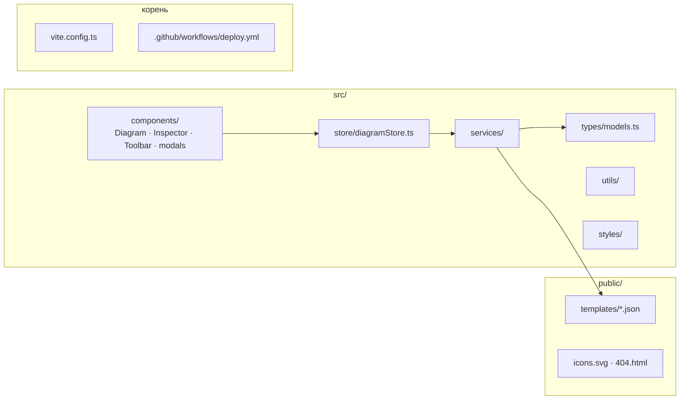

# ArchiStyler Online

Онлайн-конструктор архитектуры приложений — SPA для **GitHub Pages**. Визуально проектируйте UML-подобные схемы классов, изучайте **ООП**, **паттерны GoF** и архитектурные стили (MVP, MVVM, Repository, слои).

Портировано с десктопного [ArchiStyler](https://github.com/) (C# / Avalonia) с фокусом на **схематическое проектирование** без локальных проектов и экспорта на диск.

## Возможности

- Интерактивная диаграмма: классы, папки-слои, связи (наследование, реализация, композиция, зависимости)
- **24+ шаблонов паттернов** из `public/templates/` (MVP, MVVM, Singleton, GoF и др.)
- Превью кода **C#** и **Java**
- Тёмная неоновая и светлая тема
- Автосохранение в `localStorage`
- Импорт / экспорт `.archistyler.json` (валидация, лимит 2 МБ)
- Статическое приложение: без бэкенда, данные не уходят с устройства без явного экспорта

## Локальная разработка

```bash
npm install
npm run dev
```

## Сборка

```bash
npm run build
npm run preview
```

Для GitHub Pages **project site** (`username.github.io/repo-name/`) в CI задаётся `VITE_BASE_PATH=/<repo>/`.

Для **user/org** site (`username.github.io`) соберите с `VITE_BASE_PATH=/` (по умолчанию).

## Деплой на GitHub Pages

1. В настройках репозитория: **Pages → Source: GitHub Actions**
2. Push в `main` — workflow `.github/workflows/deploy.yml` соберёт и опубликует `dist/`

## Архитектура

Клиентское SPA без бэкенда: состояние в **Zustand**, проект в **localStorage**, шаблоны — статический JSON с GitHub Pages. Схемы ниже дублируются в [draw.io](https://app.diagrams.net/) для ручной доводки: [`docs/architecture-*.drawio`](docs/).

| Уровень | Mermaid (ниже) | Draw.io |
|--------|----------------|---------|
| Контекст системы | §1 | [`architecture-system.drawio`](docs/architecture-system.drawio) |
| Runtime (слои) | §2 | [`architecture-runtime.drawio`](docs/architecture-runtime.drawio) |
| Модель данных | §3 | [`architecture-data.drawio`](docs/architecture-data.drawio) |
| CI / деплой | §4 | [`architecture-deploy.drawio`](docs/architecture-deploy.drawio) |

### 1. Контекст системы



### 2. Runtime (слои приложения)



### 3. Модель данных (`ProjectModel`)

```mermaid
erDiagram
  ProjectModel {
    string name
    TargetLanguage language
    string defaultNamespace
    string defaultPackage
    string defaultModule
  }
  FolderDefinition {
    string id
    string name
    string segment
    float x
    float y
    float width
    float height
    string parentFolderId
  }
  ClassDefinition {
    string id
    string name
    ClassRole role
    string folderId
    MemberDefinition members
  }
  IntegrationDefinition {
    string id
    string name
    IntegrationKind kind
    string endpoint
    string folderId
  }
  RelationDefinition {
    string id
    RelationKind kind
    string fromClassId
    string toClassId
  }
  PatternTemplate {
    string id
    string category
    TemplateClass classes
    TemplateRelation relations
  }

  ProjectModel ||--o{ FolderDefinition : folders
  ProjectModel ||--o{ ClassDefinition : classes
  ProjectModel ||--o{ IntegrationDefinition : integrations
  ProjectModel ||--o{ RelationDefinition : relations
  FolderDefinition ||--o| FolderDefinition : parent
  ClassDefinition }o--o| FolderDefinition : folderId
  IntegrationDefinition }o--o| FolderDefinition : folderId
  RelationDefinition }o--o| ClassDefinition : from/to
  PatternTemplate ||--o{ ClassDefinition : applyPattern merges
```

Импорт: `ImportModal` → `validateProject()` → `loadProject()` → store → `persist()`. Экспорт: `exportJson()` → `downloadJson()`.

### 4. CI / деплой

```mermaid
flowchart LR
  PUSH["push main / master<br/>workflow_dispatch"] --> WF[".github/workflows/deploy.yml"]

  subgraph JobBuild["job: build"]
    CHECKOUT["checkout@v4"]
    NODE["setup-node 22<br/>npm ci"]
    VITE["VITE_BASE_PATH=/<repo>/"]
    BUILD["npm run build<br/>tsc --noEmit + vite build"]
    ART["upload-pages-artifact<br/>path: dist"]
  end

  WF --> CHECKOUT --> NODE --> VITE --> BUILD --> ART

  subgraph JobDeploy["job: deploy"]
    PAGES["deploy-pages@v4<br/>environment: github-pages"]
  end

  ART --> PAGES --> CDN["GitHub Pages CDN"]
  CDN --> SPA["dist/index.html + assets<br/>base из vite.config.ts"]
  SPA --> FALLBACK["public/404.html<br/>SPA redirect для deep links"]
```



### Структура репозитория



## Формат данных

```json
{
  "schemaVersion": 1,
  "name": "Моя схема",
  "language": "csharp",
  "defaultNamespace": "App.Architecture",
  "folders": [],
  "classes": [],
  "relations": []
}
```

## Безопасность

- Content-Security-Policy в `index.html`
- Строгая валидация импортируемого JSON
- Нет `eval`, нет внешних API
- Ограничения на размер и количество элементов

## Лицензия

MIT (при необходимости уточните у автора исходного ArchiStyler)
